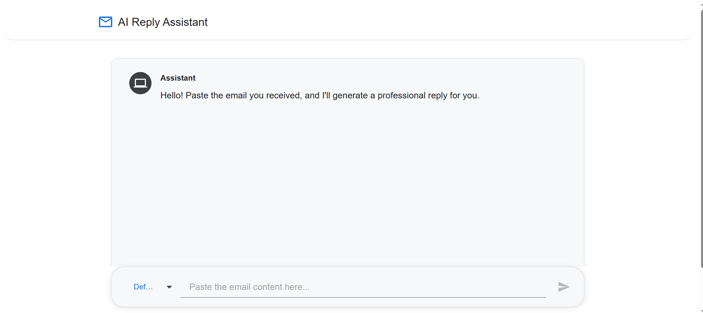
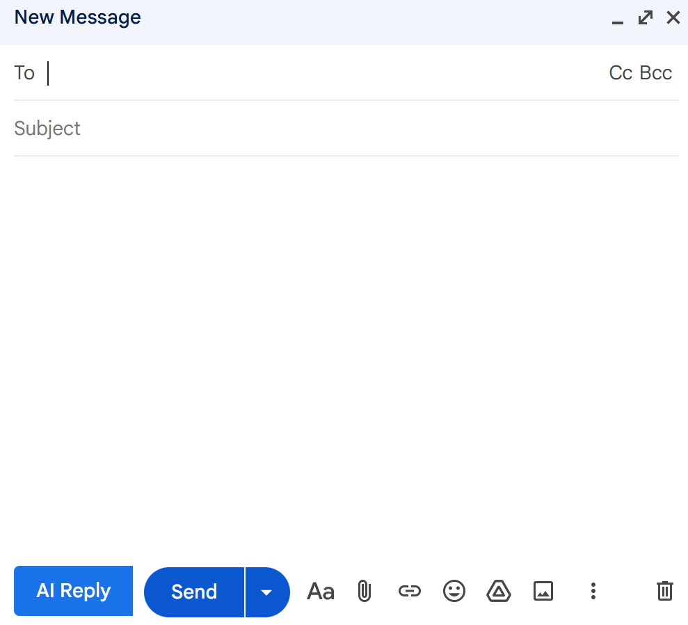

Her
---

# 📬 AiEmail-Assistant

A smart AI-powered email assistant built using **Spring Boot**, **Google Gemini API**, **React**, and a **Chrome Extension** for real-time Gmail enhancements.

---

## ✅ Features

### **Backend**

* Spring Boot 3.x (WebFlux)
* Google Gemini API integration
* Clean layered architecture
* Externalized configuration (`application.yaml`)
* CORS enabled for frontend + extension

### **Frontend (React + MUI)**

* Modern chat UI
* AI response bubbles
* Global Snackbar
* Custom theme
* Persistent conversation context
* Loader animations

### **Chrome Extension (Phase 2)**

* Injects AI actions directly into Gmail
* “Rewrite”, “Improve Tone”, “Generate Reply” buttons
* Sends email content to your backend
* Automatically replaces text in Gmail composer
* Content script + styling included

---

## 🧩 Tech Stack

### **Backend**

* Spring Boot 3.x
* Java 21
* WebFlux
* Maven
* Google Gemini API

### **Frontend**

* React 19
* Material UI 7
* Axios

### **Extension**

* Chrome Extension (Manifest V3)
* Content Script
* Gmail DOM integration

---

## 📁 Project Structure

```
AiEmail-Assistant/
│
├── aiemail-assistant-sb/        # Spring Boot backend
│   ├── src/main/java/com/aiemail_assistant_sb/
│   │   ├── config/
│   │   ├── controller/
│   │   ├── dto/
│   │   └── service/
│   └── src/main/resources/application.yaml
│
├── aiemail-assistant-fe/        # React frontend
│   └── src/
│       ├── api/
│       ├── components/
│       │   ├── chat/
│       │   ├── layout/
│       │   ├── pages/
│       │   └── ui/
│       ├── context/
│       └── hooks/
│
└── aiemail-assistant-ext/       # Chrome extension
    ├── manifest.json
    ├── content.js
    └── content.css

```

---

# 🛠️ Setup Instructions

---

## 1️⃣ Backend Setup (Spring Boot)

### **Prerequisites**

* Java 21
* Maven
* Google Gemini API Key

### **Configure API Key**

Add this to `application.yaml`:

```yaml
gemini:
  api-key: YOUR_GEMINI_API_KEY
```

### **Run the backend**

```
mvn spring-boot:run
```

Backend URL:
**[http://localhost:8080](http://localhost:8080)**

---

## 2️⃣ Frontend Setup (React)

Install dependencies:

```
npm install
```

Run Dev Server:

```
npm run dev
```

Frontend URL:
**[http://localhost:5173](http://localhost:5173)**

---

## 3️⃣ Chrome Extension Setup (Phase 2)

1. Open Chrome → go to:
   `chrome://extensions/`
2. Enable **Developer Mode**
3. Click **Load Unpacked**
4. Select:

```
AiEmail-Assistant/aiemail-assistant-ext/
```

Gmail → compose → AI buttons will appear automatically.

---

# 🌐 API Endpoints

---

## **POST /api/email/generate**

### Request:

```json
{
  "message": "Write a professional follow-up email.",
  "tone": "professional"
}
```

### Response:

```json
{
  "reply": "Here is a polished professional follow-up email..."
}
```

---

# 🧠 Chrome Extension Documentation (Phase 2)

---

## 📦 Files

```
aiemail-assistant-ext/
│ manifest.json
│ content.js
│ content.css
```

---

## ⚙ How It Works

1. Detects Gmail compose window
2. Injects floating AI buttons
3. Sends selected email text to backend
4. Inserts generated text back into Gmail

---

# 📸 Screenshots 

```
## Email Assistant UI


## Chrome Extension in Gmail

```

---


# 📄 License

MIT License

